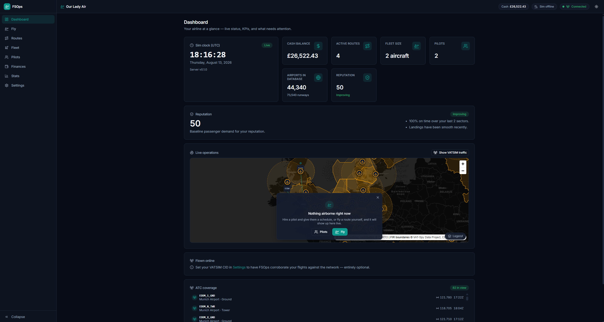
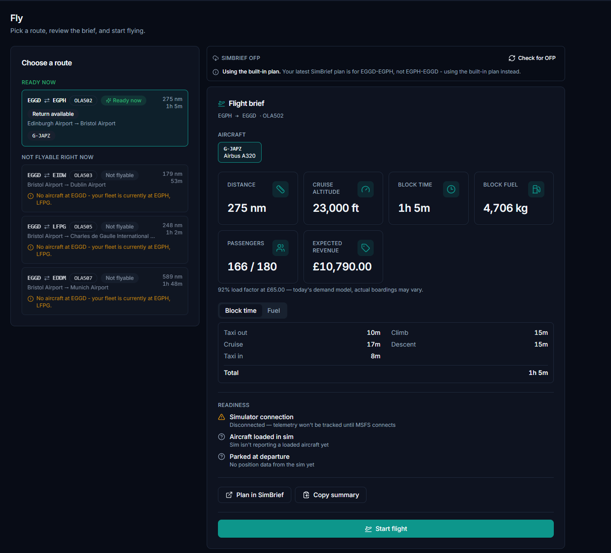

# FSOps

**Build and fly your own virtual airline in Microsoft Flight Simulator 2024.**

FSOps is a Windows companion app for MSFS 2024. Found an airline, pick a home base, a playstyle and a strategy, build out a route network, and fly it — FSOps tracks every flight live against the simulator and runs a proper economy underneath it, itemising exactly what each sector earned and cost, and billing lease, salary, insurance and loan payments on a real-world monthly cycle. Hire virtual pilots and give them a standing weekly schedule, and your airline keeps flying — and earning and spending money — on the real-world clock even while FSOps is closed, catching up on everything it missed the next time you open it. See [Status](#status-in-development) below for what's real today.

## Status: in development

FSOps is being built in the open, in public view, one feature at a time. Founding an airline, planning a route network, flying a route with full live tracking through MSFS, running a fleet (buying, leasing, selling, used aircraft, loans, maintenance), a monthly billing cycle that keeps charging you whether or not you're flying, hiring virtual pilots to fly a standing weekly schedule on the real-world clock, a Finances page, a Statistics page (with a profitability map of your whole network and cash/reputation trends) and a browsable flight logbook showing the path each sector actually flew, importing your SimBrief flight plan, and seeing online VATSIM controllers on your live map all work today. The caveat worth stating plainly: no part of FSOps has yet been exercised against a running simulator by anyone other than its author, so treat the whole MSFS-facing half as untested in the wild. See the [user guide](docs/guides/user-guide.md) for the full picture of what's built and what's coming.

## Headline features

- **Found your airline** — a full-screen setup wizard walks you through naming your airline, picking a home base airport, a playstyle (Casual or True-life — permanent for that airline's life), a strategy (international, domestic, low-cost, premium, or the balanced all-rounder), an accent colour and starter aircraft, your currency and units, and an optional startup loan. Strategy can be changed any time from Settings → Airline; playstyle cannot — switching means deleting the airline and starting over.
- **Two playstyles, chosen once** — Casual keeps starter costs low (a £30,000/month starter lease, £6,000/month insurance, a one-month deposit, £60,000 starting capital — deliberately just above the deposit plus a month's cushion, and below what a used airframe costs, so a new airline can't buy its way past actually flying) so one aircraft flown occasionally is still profitable. True-life charges realistic figures (roughly £380,000/month lease, £50,000/month insurance, a two-month deposit, £2,500,000 starting capital) and genuinely depends on hiring virtual pilots to fly standing schedules. Both run the same economy engine — only the numbers and a few behaviours (maintenance downtime, loan rate ceiling, and whether an unflyable scheduled flight is skipped or charged a cancellation fee) differ.
- **A real monthly billing cycle** — lease payments, pilot salaries, insurance and loan repayments post automatically every 30 days of real-world wall-clock time, with catch-up for however long FSOps was closed and a watermark that can't be tricked by winding your system clock forward. An idle airline still loses money every month, exactly like a real one.
- **Fleet finance, both ways** — buy an aircraft outright (new or used, at 55% of the new price but worn 70% of the way toward its next checks) or lease one, from the Fleet page. Loans are available too: the interest rate is computed automatically from how much of your airline's trailing 30-day cash flow the loan would consume, never chosen by you, capped at 5% (Casual) or 8% (True-life) APR, and a startup loan taken while founding your airline is capped outright at £250,000 (Casual) or £5,000,000 (True-life) so the wizard can't hand a new player an unpayable loan. Acquisition isn't one-way any more: **sell** an owned aircraft (at a depreciated value that always loses money on a same-day round trip) or **end a lease early** (a pro-rata charge for the part-period used plus a fee), and settle a loan **fully or partially** ahead of schedule. All three show a firm quote first, and refuse and re-quote rather than charge a different figure if it moved before you confirm.
- **Aircraft reservation is a hard rule, not a hint** — you can only fly an aircraft that's reserved to you, and a reserved aircraft is never offered to a virtual pilot's schedule. Reserving and releasing on the Fleet page is the one control that moves an aircraft between the two pools; reserving one that already has scheduled legs is refused, naming them, unless you choose to clear them.
- **Nothing stays stranded** — fly a one-way leg into an outstation with nothing going back out and that airframe is stuck. **Move** it from the Fleet page for a flat £2,000: it arrives instantly, with no block time, no airframe hours and nothing added to its maintenance cycle. You can only send it somewhere your airline already has an active route to or from (both directions count), and only an aircraft reserved to you can be moved — one released to virtual pilots is theirs to fly. It's refused, with a reason you can act on, while the aircraft is airborne, grounded for a check, or you can't afford the fee.
- **Maintenance, on your terms as well as its own** — A-checks every 500 flight hours and C-checks every 4,000 ground an aircraft for a stated period (a few hours to a day under Casual, up to a fortnight for a True-life C-check) and restore its condition; it can never happen mid-flight, only at shutdown. A virtual pilot's schedule suspends itself automatically while its aircraft is grounded and resumes the moment it's released, with no cancellation fee — and you can trigger a check early yourself from the Fleet page, at full cost, trading the hours you'd have had left for choosing exactly when the downtime lands.
- **Fuel billed on what you actually burn** — every sector pays for the fuel it genuinely used, at the departure airport's price, measured from the sim's own telemetry **from engine start onward**. Nothing you load before the engines are running is ever counted, so the fuel MSFS spawns you with, a menu fuel set, or a ground-crew uplift can't turn into a charge; and a top-up at any point never reduces the bill either. Never a flat planned figure when the sim was watching, and never a credit for fuel left in the tank. Prices still vary by airport and region and drift day to day, so departing an expensive airport costs more than a cheap one.
- **A comprehensive aircraft catalogue** — 27 real airliner types from regional turboprops through widebodies (Embraer E-Jets, ATR, Dash 8, the A320 and 737 families, A330/A350/A380, 767/777/787/747), searchable by ICAO type, manufacturer or name and filterable by narrowbody/widebody/regional, each with a real lease rate and purchase price for both playstyles. Registrations are generated in the format your airline's home country actually uses (`G-EZBA` for a UK-hubbed airline, `N737FS` for a US one, and so on) or you can type your own to match a livery.
- **Plan a round-trip route network** — search the airport database, pick a departure and arrival, and see a live plan: great-circle distance and bearing on an interactive map, block time and cruise altitude, a full fuel breakdown, expected passengers, revenue **and profit per sector**, and a suggested fare you can override before creating the route. Creating a route always creates both directions, with paired flight numbers, so your aircraft is never stranded at the outstation. Every saved route draws as a curved great-circle line on your network map, with your hub marked distinctly.
- **Set your own fares, and see the consequence before you commit** — every saved route has a fare workbench: type a fare and watch expected passengers, load factor, revenue and profit per sector move with it, against a curve of every other fare worth considering so the sweet spot is visible rather than guessed at. The app's own suggested fare, the fare that earns the most revenue, and the fare with the best sampled profit are all one click away, and it says in plain English whether you're over- or under-pricing and what changing it would be worth. The figures come from the same calculators that post to your ledger, so what you're shown before you commit is what the flight actually pays afterwards.
- **"Where should I fly next"** — a ranked list of unserved city pairs worth opening, built from your bases, your fleet and your reputation, each priced with the aircraft that would really fly it and each with a one-sentence reason. Pairs worth having that nothing you own can reach are listed too, saying exactly what stops you, rather than quietly left out. Picking one loads it into the route planner so you still see the full plan and every warning before creating anything.
- **"What should I buy next"** — a fleet planner grounded in what your aircraft are actually doing: which airframes have nothing scheduled, which routes turn passengers away for want of seats, which routes nothing you own can fly, and then what to acquire, what it costs to buy or lease at your playstyle's real rates, and what it would unlock. It will happily tell you to buy nothing and roster what you already have instead.
- **Fly a tracked flight** — pick a route on the Fly screen, review the flight brief (distance, cruise altitude, block time, block fuel breakdown), then start flying. FSOps connects to MSFS 2024 via SimConnect, auto-reconnecting whenever the sim isn't running, and tracks your flight live: phase detection (preflight through shutdown), a moving map, and live readouts of altitude, speed and fuel.
- **Landing quality scoring and report cards** — every landing is graded on touchdown rate, peak G-force, bounce count, and deviation from the runway centreline. A post-flight report card compares your actual block time and fuel burn against the plan and shows the full phase timeline with captured OOOI times.
- **Plan in SimBrief** — one click opens SimBrief with your flight prefilled (origin, destination, aircraft type, airline, flight number, registration, and the expected passenger count for this sector — never the aircraft's full seat count, which used to trigger SimBrief's own payload-limited warning on a full aeroplane); nothing is sent anywhere except to SimBrief's own site in your browser.
- **Import your OFP back from SimBrief** — set your Pilot ID once in Settings and the Fly screen pulls your latest OFP's fuel, cruise altitude, block time and filed route into the flight brief instead of FSOps' own estimate, but only when that plan is for the exact route you're about to fly. It checks automatically whenever you change route or aircraft, and on demand with a **Check for OFP** button for whenever you've just filed a plan without touching your selection here. A plan for a different city pair, or SimBrief being unreachable, falls back to the built-in planner and says so plainly rather than silently substituting the wrong numbers. Routes stay the source of truth either way — importing a plan never creates or changes one, and the fetch happens on FSOps' own server, never your browser.
- **Range is judged against your airline, not one aeroplane** — planning a route asks whether *anything you own* can fly it. If an aircraft reserved to you can, nothing is said. If nothing reserved can but your fleet has something that can, FSOps names it and suggests reserving it — and still lets you create the route. Only "nothing in your fleet can fly this" actually blocks you. The same rule holds wherever an aircraft is genuinely chosen: a virtual pilot can't be rostered onto a sector their airframe can't reach, and the Fly screen won't let you start one either.
- **Aircraft-type awareness** — FSOps checks the aircraft you're actually flying against the route's expected aircraft at family level (a 737-800 matches a 737-700 route); a mismatch is flagged for information only and never affects payment.
- **Settings that stay out of your way** — currency, distance/altitude/weight units, time display, theme and accent colour are all adjustable; changing currency only changes how numbers are displayed, never your actual balance.
- **A real airport database** — world airport and runway data imports automatically on first launch, backing route search, runway-length checks, and range validation against your fleet.
- **A deep economy simulation** — passenger demand and price elasticity decide who actually books your fare (load factor is capped around 92% no matter how cheap you go), and every flight posts itemised ticket revenue, fuel (charged on what was actually burned), landing/handling/parking/passenger fees, maintenance accrual, and crew cost to your airline's append-only ledger. There's no fare cap — the simulation is the guardrail: price too high and passengers, and eventually the market itself, evaporate rather than rewarding you for gouging a captive handful of them. A slew or teleport during tracking voids that sector's revenue outright, never quietly discounts it.
- **Reputation actually moves, and it moves bookings with it** — on-time performance is the main driver, landing quality (yours or a virtual pilot's, scored on the same scale) a smaller one, and a cancelled or skipped sector costs more standing than any delay; a sector grounded by maintenance never counts against you, since the schedule wasn't at fault. Reputation 100 sells roughly 25% more seats than reputation 50, reputation 0 about 25% fewer — floored so a bad run is always recoverable, and it takes 40–60 solidly-flown sectors to climb from 50 to 75. Completing a flight manually costs a small fixed penalty (the sector couldn't be verified) and abandoning one costs as much as a cancellation, on top of the ticket revenue and fuel already spent. The Dashboard shows the number, its direction, and a plain-language account of what's actually driving it.
- **Hire virtual pilots and build their week around an aircraft, not a leg** — from the Pilots page, hire as many pilots as you want at a standard monthly salary (no upfront cost), then give each one a repeating weekly schedule: pick the aircraft for a duty day first, then drop the legs it flies into a diary-style grid (time down, days across), with by-pilot and by-aircraft views plus a read-only, colour-coded overview of your whole fleet's week. Anything that can't fly shows disabled with one plain reason and a link that fixes it, rather than vanishing or dropping a wall of text. Their flights are full economic citizens: they earn ticket revenue and pay every real cost — fuel, landing/handling fees, maintenance accrual, crew cost, their own salary — the same way a flight you fly yourself does, and they advance the aircraft's hours, wear and position exactly as a player flight would. Your own flying hours now count too, on the Pilots page, the same as any virtual pilot's.
- **Pilots improve with experience, and rust if you forget them** — a pilot's skill climbs with hours flown toward a cap it's never quite allowed to reach, so even your most experienced hire still varies a little. A virtual pilot left off every schedule for more than two weeks starts losing some of what they earned, the way real currency does; keep flying them — including on the standing weekly schedule that runs while FSOps is closed — and skill never decays. Your own record is exempt entirely: your flying is always judged by real telemetry, never by this number.
- **A wall-clock economy that runs while you're away — and explains itself when you get back** — virtual pilots' flights complete against the real-world clock, not the time you spend with FSOps open. Close the app for a few hours, a few days, or longer, and reopen it: every flight that was due, and every monthly bill, has already been resolved and posted, all the way up to the moment you closed it, capped so a very long gap catches up over a few passes rather than in one enormous burst. It can't be tricked by winding your system clock forward or back either. If enough happened while you were gone, a "while you were away" summary greets you on startup — what was charged, what your pilots flew and earned, maintenance that fell due, and anything skipped, cancelled or suspended, with its reason.
- **A Finances page** — cash balance and trend, income against expenditure for the current period, every lease with its real next-payment date (a rolling 30 days from your airline's own clock, not the calendar) and an end-lease action, every loan with full or partial early repayment, per-pilot revenue versus cost, a fixed-versus-variable cost split, a filterable itemised ledger, and profit and loss per route. Figures that are estimates (a pilot's salary prorated to the window shown) are labelled as such; everything else comes straight from the ledger.
- **A live operations map on the Dashboard** — see your whole route network plus every aircraft currently airborne, virtual pilots included (their position is calculated from the schedule and elapsed time, not stored), with your own tracked flight shown distinctly from theirs. Hover any aircraft for a flight card: flight number, route, pilot, aircraft, departure/arrival times, and percentage complete. Both things drawn over the map — the "nothing airborne right now" message and the ATC legend — fold away to a small pill you can reopen, so neither ever sits permanently between you and the map underneath.
- **Online VATSIM controllers on the same map** — controllers whose coverage is currently on screen, with callsign, frequency and how long they've been logged on, shown alongside your own aircraft; the ones covering an airport in your own network are listed first. Both VATSIM layers **start hidden**, behind a matching pair of buttons above the map — **Show VATSIM ATC** and **Show VATSIM traffic**. Off means nothing is even fetched for that layer, so the dashboard stays about your airline rather than the whole network until you ask otherwise. The two are independent, and neither affects your own aircraft or your virtual pilots'. FSOps' server fetches and caches VATSIM's public feed once and shares that copy with the browser; the browser never talks to VATSIM directly, and if the feed's unreachable the rest of the map is unaffected.
- **A Statistics page** — on-time performance and load factor over time, revenue against cost, profit per route, fleet utilisation including hours to each aircraft's next check, and a pilot logbook covering you and every virtual pilot, over a selectable trailing period (7, 30 or 90 days) with a CSV export on every table. Every figure is read back from the ledger and flight records rather than recomputed, and on-time performance uses the identical rule the reputation score does, so the two can never disagree.
- **A network map that shows you which routes are worth flying** — your whole route network on one map, every city pair coloured by **profit per sector**: what one more flight on it adds to the bank. Green is at or above your own network average, amber below it, red loses money every time, grey never flew in the window. The legend states the average it judged against, in money, and picking any route gives you a one-sentence account of its colour plus its revenue, cost, margin, load factor and how each direction did on its own — a route that earns outbound and loses coming back has nowhere to hide. The figures are the same per-route P&L the Finances page shows, not a second calculation of it.
- **Trends, so you can see direction rather than a single number** — cash plotted from the ledger itself, day by day, so the line is the same money the Finances page shows on the day it moved, with zero marked. Alongside it, reputation: your genuinely recorded score, written down once a day, plus a "pressure" line showing what each day's flying was pulling reputation *toward* — the same figure the Dashboard's reputation card uses to say "improving" or "declining", and the only one that works retroactively. Reputation is not reconstructed from history, because it honestly cannot be; days FSOps was not running are shown as gaps rather than filled in.
- **A flight logbook worth browsing** — every sector you have actually flown, sortable by date, route, aircraft, block time against plan, landing rate or what it earned, and filterable by status, by whether you or a virtual pilot flew it, and by whether it has a flown track. Totals follow the filter rather than ignoring it. Anything that genuinely could not be measured — a landing the sim never reported a rate for, a block time made meaningless by time acceleration — reads "Not measured" and sorts last in both directions, never as a flattering zero.
- **The path you actually flew, drawn on the flight's own record** — FSOps has recorded a position every 15 seconds of every tracked flight since tracking existed; now you can see them. The flown track is drawn over the great circle the sector was planned along, so the vectors, the hold, the long downwind and the diversion all show up as the difference between the two lines. A sector with no track — one of your pilots flew it, so there was no simulator attached to record from, or it predates position recording — says exactly that instead of opening an empty map.
- **Updates you're told about, never updates that happen to you** — FSOps can check whether a newer release exists and tell you, quietly and only when there is one. If you ask it to, it downloads the installer and checks it against the release's published SHA-256 before doing anything else, then opens the folder so you can run it yourself. **It never runs an installer for you** — FSOps ships unsigned, so that checksum is the only thing separating the real installer from whatever turned up over the network, and the decision to run it stays yours. The check is off the startup path entirely, fails silently when there's no internet, and can be switched off completely — off means no request is made at all.

## Quick start

New to FSOps? The [Installation guide](docs/guides/installation.md) covers downloading the installer, verifying it, and your first launch. If you'd rather build from source — to change FSOps, or to run something that hasn't been released yet — [Getting Started](docs/guides/getting-started.md) is the one to follow instead.

Once it's running, the [User Guide](docs/guides/user-guide.md) walks through every feature area as it actually behaves today.

Running into trouble? Check the [Troubleshooting guide](docs/guides/troubleshooting.md).

Interested in how it's built? See [Architecture](docs/architecture.md).

## Tech stack

- **Backend:** .NET 8 (C#), talking to MSFS via SimConnect (through the `CTrue.FsConnect` library)
- **API & real-time:** ASP.NET Core REST API plus SignalR for live push updates (telemetry, hub connection status, flight-completion notifications)
- **Frontend:** React + TypeScript, built with Vite and styled with Tailwind CSS and shadcn/ui, served locally by the backend and shown either in the desktop window or your browser; MapLibre GL for the route and live-flight maps
- **Storage:** SQLite, accessed through Entity Framework Core
- **External data:** SimBrief's OFP fetch and the VATSIM ATC feed are both called and cached on the server; the browser never calls out to either directly
- **Tests:** xUnit for the backend (`dotnet test`); [Vitest](https://vitest.dev/) for the frontend (`npm test` or `npm run test:run` in `src/fsops-web`), covering pure logic, API request bodies, dialog state, and component rendering — deliberately no DOM-snapshot or pixel tests, which break constantly and prove little

- **Desktop shell:** a WebView2 window (`FSOps.Desktop`) so FSOps is an app with its own window and taskbar entry, not a browser tab. The server runs as a child process tied to the window's lifetime, and if the WebView2 runtime isn't available the UI simply opens in your default browser instead — nothing is ever a prerequisite

Everything runs locally at `http://localhost:5977`. The desktop window is the normal way in, but the browser works just as well, and both are the same app — set `FSOPS_USE_BROWSER=1` if you'd rather always use your browser. Open the desktop app while a browser copy is already running and it attaches to it rather than starting a second one, so there's only ever one database in play.

## Project structure

```
FSOps/
├── src/
│   ├── FSOps.Core/       # Domain model, money/planning/finance logic (no framework deps)
│   │   ├── Airlines/     #   Airline creation defaults, registration generation
│   │   ├── Airports/     #   Airport search ranking, size categorisation
│   │   ├── Economy/      #   Demand, fares, fuel pricing, flight costs, itemised ledger postings
│   │   ├── Entities/     #   Domain entities (Airline, Route, FleetAircraft, Flight, FlightEvent, ...)
│   │   ├── Finance/      #   Loan, disposal (sale/lease-termination) and loan-settlement calculations
│   │   ├── Fleet/        #   Aircraft repositioning: eligible destinations, refusal rules, fee arithmetic
│   │   ├── Flights/      #   Flight-phase state machine, landing quality, aircraft-type matching
│   │   ├── Money/        #   Currency catalogue and base-unit formatting
│   │   ├── Planning/     #   Route preview: distance, bearing, block time, fuel, fare
│   │   ├── Routes/       #   Flight number generation
│   │   └── Scheduling/   #   Weekly schedule validation (aircraft-per-duty-day), occurrence timing, pilot performance
│   ├── FSOps.Data/       # EF Core + SQLite persistence, world data import
│   ├── FSOps.Sim/        # Sim abstraction: the SimConnect adapter and a replay-based fake source
│   ├── FSOps.Server/     # API endpoints (fleet, disposal, repositioning, maintenance, finance, stats, pilots, flights, VATSIM ...), SignalR hubs, flight lifecycle/virtual-flight-resolver/economy-clock/reservation-reconciler services, the SimBrief and VATSIM network clients, and serves the built web UI
│   ├── FSOps.Desktop/    # The WebView2 window a user actually launches; runs the server as a child process
│   ├── fsops-web/        # React + TypeScript + Vite + Tailwind + shadcn/ui frontend
│   │   └── src/components/
│   │       ├── flight/   #   Fly screen pieces: route selector, brief (with the SimBrief import banner), live view, report card
│   │       ├── schedule/ #   A virtual pilot's weekly schedule builder (aircraft-per-duty-day, by-pilot/by-aircraft/overview views)
│   │       ├── finance/  #   Finances page sections: leases, loans, per-pilot P&L, cost split, routes P&L, ledger
│   │       ├── fleet/    #   Fleet page: buy/lease, reservation, reposition, sell/end-lease dialogs
│   │       ├── maintenance/ # Perform-maintenance-now and "while you were away" dialogs
│   │       ├── logbook/  #   Flight logbook: the sortable sector table and its filter bar
│   │       ├── stats/    #   Statistics page: trend/performance/finance charts, the route-network performance section, fleet utilisation and pilot logbook tables, CSV export, period selector
│   │       └── map/      #   Route network, network-performance, flown-track, live-flight and live-operations maps (MapLibre GL), plus the VATSIM controller list/markers
├── tests/
│   ├── FSOps.Core.Tests/   # xUnit tests for domain, planning, and flight-tracking logic
│   └── FSOps.Server.Tests/ # xUnit tests for route pairing and airline-summary endpoints
│                           #   (Vitest tests live beside the frontend code they cover, in
│                           #   src/fsops-web/src/**/*.test.{ts,tsx} — see Tech stack above)
├── docs/
│   ├── architecture.md
│   └── guides/
│       ├── getting-started.md
│       ├── installation.md
│       ├── user-guide.md
│       └── troubleshooting.md
├── Screenshots/          # Images used by the README and the user guide
└── README.md
```

## Screenshots



The Dashboard, with an airline four routes and two aircraft into its life. The sim clock runs off the simulator's own time; the KPI row and the reputation card beneath it read straight from the ledger and the last few sectors. The live operations map draws the route network with anything currently airborne on top of it — here, nothing is, so the map says so in a card that folds away to a pill if you'd rather see what's underneath. Both VATSIM layers start hidden behind the **Show VATSIM ATC** and **Show VATSIM traffic** buttons above the map; with ATC off there is no ATC coverage card beneath it either.



The Fly screen. Routes are split into what you can fly right now and what you can't, and an unflyable one always says why — here, three routes want an aircraft at Bristol and the fleet is at Edinburgh and Paris. The SimBrief panel at the top is declining a real OFP on purpose: the plan on file is for the opposite direction, so the built-in plan is used and the reason is stated rather than the wrong fuel figures being applied quietly. Below it, the brief for the sector that *is* flyable, and three readiness checks that inform but never block.

More screens — the route network, the ledger, a post-flight report card, and the catch-up summary you get after leaving FSOps closed — appear throughout the [User Guide](docs/guides/user-guide.md).
